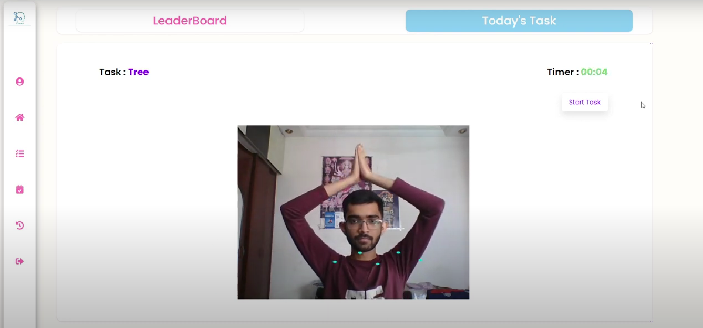

<h1 align="center">Druid</h1>
<p align="center"><b>Google Solution Challenge</b> submission <b>2022</b></p>
<p align="center">

</p>

<P align="center"></p>
<br/>

# video submission
<p>You can checkout the video submission by clicking on the thumbnail</p>
<p align="center">
<a href="https://www.youtube.com/watch?v=HiBIJ8ckH1c" align="center" width="100%">

</a>
</p>

# Features
- Daily Task/Yog
- Health Record
- Book for offline Appointments
- Digital Prescriptions


# Description


- Daily task feature resorts a more traditional exercise YOGA. The feature uses MI Model to analyse your form and starts the timer accordingly.

- book appointments allows users to book appointments with doctors & are provided with token numbers to track their estimated time.

- Digital prescriptions by the doctors are stored and can be accessed by users at ease.

- Apart from all the other functionalities we also maintain health record for each patient which stores information about user’s diseases and allergies. The health record can come in handy for doctors at the time of analyzing patients as well as when writing prescriptio


<br>

## Setup

#### Clone the repository
```bash
git clone https://github.com/Hetu1107/Druid
```
#### Move to the backend folder
```bash
cd backend
```
#### Run server
```bash
nodemon server
```
#### Move to client folder
```bash
cd ../client
```
#### Run the app
```bash
npm start
```
<br/>

## Made with ❤️ by 
<a href="https://github.com/Hetu1107"></a>
<a href="https://github.com/Naitik6803"></a>
<a href="https://github.com/zaidm124"></a>
<a href="https://github.com/RavenClaaaw"></a>
